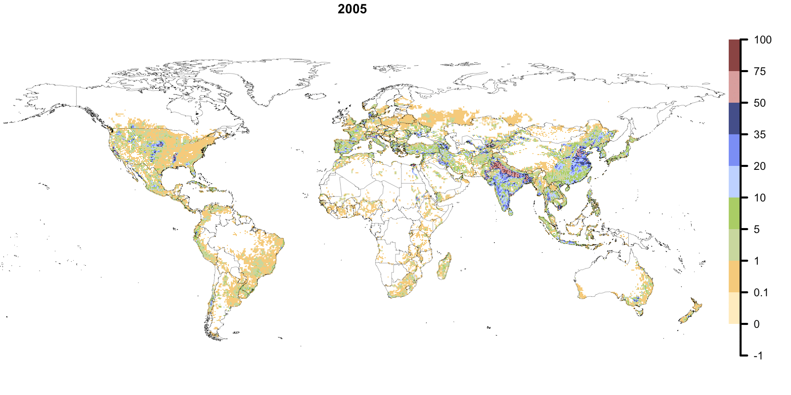

```{r include=FALSE}
knitr::opts_chunk$set(echo = FALSE, warning = FALSE, message = FALSE)
```

```{r admin}
library(dagitty)
library(ggdag) 
library(corrplot)
library(dplyr) 
library(ggmap)
library(raster)
library(ggplot2)
library(rnaturalearth)

#change this if need be
setwd("/Volumes/RachelExternal2/Thesis/Master_Thesis")
```

# Methods {#methods}

## Data {#data}

To appropriately choose data that encapsulates the concepts and relationships described in Section \@ref(drivers) the following datasets and variables were collected and selected. It should be noted that many of these datasets contain more than one variable that would conceptually represent the links between expanding irrigation and various drivers. The predictors presented below were selected based on various reasons including data availability (both spatially and temporally) and conceptual fidelity. For more information on all potential variables please see Appendix Section \@ref(predselect).

### Outcome Variable: Irrigation Fraction {#irrfrac}

#### Global Historical Irrigation Data Set {#HID}

Data for global historical irrigation patterns was collected from the Global Historical Irrigation Data Set (HID) [@siebertGlobalDataSet2015] which describes hectares of area equipped for irrigation (AEI) per grid cell at a 5 arcmin resolution [^1] over a period of 105 years, from 1900 to 2005. By documenting global and historical irrigation patterns, @siebertGlobalDataSet2015 hoped to create a better understanding of the evolution of said patterns. It is worth noting that the dataset provided in @siebertGlobalDataSet2015 documents area equipped for irrigation, meaning area that is equipped with infrastructure to irrigate crops but not *necessarily* irrigated. In addition, rainwater harvesting [^2] is also not included in the summation of area equipped for irrigation. [CITATION]

[^1]: At the equator, this is roughly a 9.2km by 9.2km grid cell resolution.

[^2]: The act of harvesting rainwater during rain and then later applying it to crops.

To amass this data @siebertGlobalDataSet2015 used a variety of sources to collect national and subnational statistics including FAOSTAT [@faoFAOSTAT2021], EuroStat [@europeancomissionEurostatDatabase2021], and Aquastat [@faoAQUASTAT2021] along with other less collected sources like census data and statistical yearbooks. Data was recorded for 10 year timesteps until 1980 and five year timesteps until the termination of the study period in 2005. Data for the period prior to 1950 and for the year 2005 has higher levels of uncertainty in the measurements when compared to the data between 1950 and 2005, as irrigation data from international organizations (e.g. FAO) were unavailable prior and post. After collection the data was harmonized and downscaled to a 5 arcmin resolution. Special care was taken to ensure that high resolution data (at a 5 arcmin resolution) could be accurately summed to the subnational level, ensuring accuracy at different resolutions. In addition, the authors note that validation of this dataset was not possible due to the fact that all available data was used as input to create the HID [@siebertGlobalDataSet2015].

The HID, in combination with other datasets such the History Database of the Global Environment ( @kleingoldewijkHundredYear18901997, see Section \@ref(HYDE)) and Climate Research Unit Time Series Data ( @universityofeastangliaclimaticresearchunitVersionCRUTS2021, see Section @ref(CRU)) were used was then fed into the LPJmL model. The Lund-Potsdam-Jena managed Land (LPJmL) is a Dynamic Global Vegetation Model which simulates the global terrestrial carbon cycle and the corresponding response of vegetation patterns, both natural and managed, under a given set of climactic conditions [@schaphoffLPJmL4DynamicGlobal2018]. Spatially and temporally explicit data regarding climate, landuse patterns, and anthropogenic activities among others is fed into the model and used to simulate, via the LPJmL's established biophysiological interconnections, a multitude of processes and outcome that relate to global vegetation patterns and carbon cycles[@pikLPJmLLundPotsdamJenaManaged]. For the purposes of this masters thesis, a global irrigation pattern represented by percentage of irrigated area per cell at a 0.5° x 0.5° latitude longitude global grid cell resolution with yearly observations for a period of 1960 to 2005 was extracted from the LPJmL model .

#### Description {#irrfracdesc}

Levels of irrigation vary widely both geographically and temporally. In Figure \@ref(fig:irrfrac2005) the global irrigation pattern for the last year of they study period (2005) is depicted.

<!-- Comment this out when knitting to PDF. -->

<!--  -->

<!-- Comment this out when knitting to Gitbook. -->

```{r irrfrac2005, fig.cap = "Percentage of a cell's area covered by land equipped for irrigation. Represents the global irrigation pattern at a 0.5° x 0.5° latitude longitude grid cell resolution for the last year of the study period (2005).", out.width= "1000px", echo=FALSE}


```

There are several "hotspots" of irrigation that occur, predominantly in the interior of the United States, north of India, Bangladesh, and Eastern China in which more than 30% of a cell is irrigated area. Otherwise, generally irrigation, where it exists, a small minority of cell area. No irrigation occurs in some places including towards arctic circle and in the Sahara, among other places.

When looking at the histogram of the data distribution of the target variable, irrigation fraction, it is clear to see that the data includes many zeros.

```{r}


```

### Water: Precipitation {#precip}

To encapsulate the relationship between the presence/absence of irrigation or the amount of irrigation in a cell and water, precipitation was chosen to represent this link. Several other variables existed that would have also represented the connection between a water source and irrigation expansion, however to reduce multicollinearity, only one variable could be used to encapsulate all the effects of water. Through an iterative modeling process of checking the strength and stability of different predictor effects, precipitation was ultimately chosen. In addition, using precipitation as a predictor conveniently fits best within the conceptual framework better than others with the notion that farmers will begin to irrigate when there precipitation cannot meet crop demand.

#### Climate Research Unit Time Series Dataset {#CRU}

Data for precipitation was collected from the Climate Research Unit of the University of East Anglia. This dataset is open-source and includes monthly precipitation data for a 0.5° x 0.5° latitude longitude global grid cell resolution over a time period of 1901 to 2018. To collect this data, individual station observations were anomolized by using the each station's monthly mean from the years 1961 to 1990 to standardize observations as a percentage of the mean monthly value (value of -100 means 0 precipitation, value of 0 is equal to monthly mean for a given station). These anomolies were then converted to a 0.5° x 0.5° latitude longitude grid using angular distance weighting ultimately giving rise to a single monthly value for each grid cell [@universityofeastangliaclimaticresearchunitVersionCRUTS2021].

<!--# What happened in LPJmL here!! -->

#### Description {#precipdesc}

Below

### Topography: Ruggedness {#rugged}

<!--# Come back and fix this part!! -->

In order to explain the relationship between topography and irrigation expansion, an index of a country's topographical heterogeniety was chosen. Other similar irrigation expansion studies similarly use slope (calculated from Digital Elevation Models (DEMs)) as a predictor for explaining irrigation expansion but do so using a 5 arcmin gridded slope dataset [@neumannExploringGlobalIrrigation2011]. Unfortunately for this thesis, grid cells used for analysis are significantly larger[^3], and an aggregation of slope to a larger grid cell was unfeasible for this thesis. Instead, a well know index of country topographical heterogeneity was chosen to represent the "ruggedness" of a country.

[^3]: A 5 arcmin global grid results in a 9.2km by 9.2km grid at the equator. This thesis uses a 0.5° x 0.5° lattitude longitude grid which produces a grid cell of about 55km by 55km at the equator.

#### Terrain Ruggedness Index {#TRI}

The Terrain Ruggedness Index (TRI) was developed by @rileyTerrainRuggednessIndex1999 initially to be used to analyze the effects of topography on species habitats and behaviors. The authors developed a simple method to calculate the heterogeneity of a given area using DEMs. To do so the sum change in elevation is calculated for a cell and its eight nearest neighbors. These individual cell level TRIs can then be averaged for a given region, in this thesis's case, a country [@rileyTerrainRuggednessIndex1999 ]. Adapted from @rileyTerrainRuggednessIndex1999, a representation of how TRI scores are calculated for differing types of terrain.

<!--# Insert the calcluation of TRI here -->

#### Description {#ruggeddesc}

In Figure \@ref(fig:TRI) the Terrain Ruggedness Index for the study region can be see. Higher values indicate countries with more topographical heterogeneity, and lower values represent less. As you can see

```{r TRI, fig.cap="Terrain Ruggedness Index for the study area. TRI values "}


world <- map_data("world") 

read.csv(file = "data/aei_nocrop.csv") %>% 
  dplyr::select(lat, lon, rugged) %>% 
  unique() %>% 
  ggplot() + 
  geom_tile(aes(x=lon,y=lat,fill=rugged)) +
  scale_fill_viridis_c() +
  geom_polygon(data=world,aes(x=long, y=lat, group=group), 
               colour="black", fill="white", alpha=0)+
  theme_minimal()+
  theme(
    panel.grid.major = element_blank(),
    panel.grid.minor = element_blank(),
    axis.title.x=element_blank(),
        axis.text.x=element_blank(),
        axis.ticks.x=element_blank(),
    axis.title.y=element_blank(),
        axis.text.y=element_blank(),
        axis.ticks.y=element_blank()
  )
```

### Social Influences: Population Density {#popdens}

#### The History Database of the Global Environment (HYDE)

The History Database of the Global Environment (HYDE) was first developed by @kleingoldewijkHundredYear18901997 to better understand and map historical land use patterns anthropogenic activities. Several updates to this dataset have taken place since the publication of the original dataset and currently HYDE Version 3.2 currently includes population estimates and land use patterns for the entirety of the Holocene, which spans the last 12,000 years [@kleingoldewijkAnthropogenicLandUse2017].

For the study period (1960-2005) of this masters thesis, estimates of total population were collected from the United Nations World Populations Prospects [@unitednationspopulationdivisionWorldPopulationProspects2008]. Then this data is harmonized with world wide spatial population patterns from Land Scan [@oakridgenationallaboratoryLandScanLandscanGlobal2014] which shows global population density at a 1km resolution and was used to allocate population totals to each available administrative unit [@kleingoldewijkAnthropogenicLandUse2017]. Population data was then harmonized and scaled resulting in a final data product that yields population density, and other important land use data, on a 0.5° x 0.5° latitude longitude global grid.

This

#### Description {#popdensdesc}

A description of population density estimates from

### Economics: Income {#gdppc}

#### Maddison Project Database {#maddison}

#### Description {#gdppcdesc}

### External Influences: Democracy {#democracy}

#### Bjørnskov-Rode Regime Data {#BRdemo}

#### Description {#demodesc}

The base dataset used for this thesis was constructed as an input for LPJmL. A combination of global irrigation patterns from t[@schaphoffLPJmL4DynamicGlobal2018]. This dataset was then fed into LPJmL to and used to derive different variables including irrigation, cropland, and crop fraction on a per grid cell basis.

### Compatibility: Distance to the Next Irrigated Cell {#dist}

#### LPJmL Derived Output {#distdata}

#### Description {#distdesc}

## Hypothesis {#hypothesis}

Based on information discussed above several hypothesis can be formed to investigate the expected effects of different predictors. As discussed previously there are two outcome variables in this masters thesis: the presence/absence of irrigation and the amount of irrigation. Hypothesis are similar for both predictor variables. The rational is explained below in addition to the hypothesis.

<!--# explain rationale! -->

For the amount of irrigation present in a cell the stated hypothesis for this thesis are:

1.  A **decrease in precipitation** will result in an **increase in irrigation**.
2.  A **decrease in population density** will result in an **increase in irrigation**.
3.  An **increase in income (GDP per capita)** will result in an **increase in irrigation.**
4.  A **decrease in topographical heterogeniety (ruggedness)** will result in an increase in **irrigation.**
5.  An **increase in democratic values** will result in an **increase in irrigation.**

For the presence or absence of irrigation, the following hypothesis are proposed:

1.  A **decrease in distance to the next irrigated cell** will result in an **increase of irrigated cells.**
2.  An **increase in population density** will result in an **increase in irrigated cells.**
3.  A **decrease in precipitation** will result in an **increase in irrigated cells.**
4.  An **increase in income (GDP per capita)** will result in an **increase of irrigated cells.**

## Study Region {#studyreg}

To be able to investigate the patterns of global historical irrigation expansion, the initial proposed study area encompassed the entirely of the globe's terrestrial land mass with recorded observations detailing every year for the 45-year study period. This constituted a data set of roughly three million observations. In an effort to decrease computation time, a logical reduction of the study area (and therefore data) was necessary.

Figure \@ref(fig:irrfrac-2005) illustrates the pattern of irrigation at the last time step (2005) of the study period. It is notable that irrigation does not exist at all in some places such as the higher latitudes and the Sahara. These areas also contain no cropland, no managed grasslands, and no pastureland. Upon the logic that irrigation cannot expand into areas that contain no agricultural land (whether it be cropland, grassland, or pasture land), all cells which contained no agricultural land over the the course of the study period were removed, giving rise to the study area you see in figure \@ref(fig:study-region-nocrop).

```{r study-region-nocrop, fig.cap="Final study area after the removal of cells with no agricultural land over the course of the 45 year study period. Colors represent regional groupings. Notice that excluded areas are located within the Amazon, the Sahara, Central Africa, the Middle East, Eastern China, and toward the Arctic Circle (represented at 60 degrees North with a red horozontal line). "}

world <- map_data("world") 

read.csv(file = "data/aei_nocrop.csv") %>% 
ggplot() + 
  geom_tile(aes(x=lon,y=lat,fill=six_regions)) +
  geom_polygon(data=world,aes(x=long, y=lat, group=group), 
               colour="black", fill="white", alpha=0) + 
  geom_hline(yintercept = 60, color = "red") +
  theme_minimal()+
  theme(
  legend.position = "none",
    panel.grid.major = element_blank(),
    panel.grid.minor = element_blank(),
    axis.title.x=element_blank(),
        axis.text.x=element_blank(),
        axis.ticks.x=element_blank(),
    axis.title.y=element_blank(),
        axis.text.y=element_blank(),
        axis.ticks.y=element_blank()
  )
```

## Modeling {#bayesintro}

### Thinning {#thin}

#### Thinning for Conceptual Clarity {#nocrop}

#### Thinning for Autocorrelated Structures {#autocorr}

| *"The first law of geography: Everything is related to everything else, but near things are more related than distant things." - Walter Tobler [@toblerComputerMovieSimulating1970]*

Bayesian inference has some unique features in comparison to other forms of statistical influence. For the context of this thesis the two main advantages or Bayesian Inference are an improved propagation of uncertainty throughout the modeling process and an ability to include prior information into models, allowing the inclusion prior knowledge [@gelmanRegressionOtherStories2020].

### Standardization

### Time Series Constraints

### Hierarchical Modeling

#### DAGs

A Directed Acyclic Graph (DAG)

```{r mudag, fig.cap= "Directed Acyclic Graph for Beta"}
irrfrac_dag <- dagify(
  irrfrac ~ income + popdens + precip + ruggedness + dist + medinc,
  income ~ demo,
  popdens ~ demo,
  dist ~ demo,
  outcome = "irrfrac",
  exposure = c("income", "precip", "ruggedness", "dist", "popdens", "medinc"),
  latent = "demo",
  labels = c(irrfrac = "Irrigation Fraction", income = "Income",
             popdens = "Population Density", precip = "Precipitation",
             ruggedness = "Ruggedness",
             dist = "Distance to Next Irrigated Cell", 
             medinc = "Median Yield Increase", 
             demo = "Democracy",
             unobserved = "Confounders")
)

ggdag_status(irrfrac_dag, use_labels = "label", text = FALSE) +
  guides(fill = "none", color = "none") +  # Disable the legend
  theme_dag()
```

```{r zidag, fig.cap= "Directed Acyclic Graph for zero inflated paramater zi"}
zi_dag <- dagify(
  irrfrac ~ income + precip + ruggedness + dist,
  income ~ demo,
  dist ~ demo,
  exposure = c("income", "precip", "ruggedness", "dist"),
  latent = "demo",
  outcome = "irrfrac",
  labels = c(irrfrac = "Irrigation Fraction", income = "Income",
             popdens = "Population Density", precip = "Precipitation",
             ruggedness = "Ruggedness",
             dist = "Distance to Next Irrigated Cell", 
             medinc = "Median Yield Increase", 
             demo = "Democracy",
             unobserved = "Confounders")
)

ggdag_status(zi_dag, use_labels = "label", text = FALSE) +
  guides(fill = "none", color = "none") +  # Disable the legend
  theme_dag()
```

To test these hypothesis, a quick view of correlations was carried out.
