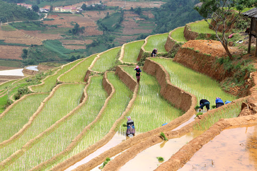

```{=html}
<!--
Above is the YAML (YAML Ain't Markup Language) header that includes a lot of 
metadata used to produce the document.  Be careful with spacing in this header!

If you'd prefer to not include a Dedication, for example, simply delete the section entirely, or silence them (add # before each line). 

If you have other LaTeX packages you would like to include, delete the # before header-includes and list the packages after hyphens on new lines.

If you'd like to include a comment that won't be produced in your resulting file enclose it in a block like this.

If you receive a duplicate label error after knitting, make sure to delete the index.Rmd file and then knit again.
-->
```
```{r include_packages, include=FALSE}
# This chunk ensures that the thesisdown package is
# installed and loaded. This thesisdown package includes
# the template files for the thesis.
if (!require(remotes)) {
  if (params$`Install needed packages for {thesisdown}`) {
    install.packages("remotes", repos = "https://cran.rstudio.com")
  } else {
    stop(
      paste('You need to run install.packages("remotes")",
            "first in the Console.')
    )
  }
}
if (!require(thesisdown)) {
  if (params$`Install needed packages for {thesisdown}`) {
    remotes::install_github("ismayc/thesisdown")
  } else {
    stop(
      paste(
        "You need to run",
        'remotes::install_github("ismayc/thesisdown")',
        "first in the Console."
      )
    )
  }
}
library(thesisdown)
# Set how wide the R output will go
options(width = 70)
```

```{=html}
<!--
The acknowledgments, preface, dedication, and abstract are added into the PDF
version automatically by inputting them in the YAML at the top of this file.
Alternatively, you can put that content in files like 00--prelim.Rmd and
00-abstract.Rmd like done below.
-->
```
```{r eval= !knitr::is_latex_output(), child=here::here("prelims", "00--prelim.Rmd")}

```

```{r eval=!knitr::is_latex_output(), child=here::here("prelims", "00-abstract.Rmd")}

```

```{=html}
<!-- The {.unnumbered} option here means that the introduction will be 
"Chapter 0." You can also use {-} for no numbers on chapters.
-->
```
# Introduction {#intro}

The practice of irrigation, and its subsequent impacts, have far reaching effects for the global economy, food and water supply, and environment. Irrigated land accounts for 20% of the global cultivated land area which derives 40% of the global food supply [@neumannExploringGlobalIrrigation2011, @portmannMIRCA2000GlobalMonthly2010a], 70% of water withdrawls from ground water aquifers are used for irrigation [@faoStateWorldLand2011], and

## Objectives {#objectives}

Ultimately, the agricultural system will continue to demand more water while competing with other sectors over decreasing water availability in the coming years. With this pressure, farmers will aim to be as efficient as possible by increasing their yields which, in certain areas and under certain conditions, can be done by irrigating their fields. Understanding where, when, and why farmers decide to begin irrigating is important to understand water demands now and in the future. Unfortunately, irrigation expansion is seldom studied, with few studies using statistical modeling techniques to investigate the role that biophysical, economic, and political factors play in the spread of irrigation infrastructure in the present. None do so historically. This leads to the first and overarching research question:

<center>

*Which factors (drivers) have influenced the expansion of irrigation in both time and space over the past 100 years?*

</center>

By understanding under which conditions irrigation infrastructure is built could be coupled with projections of future climate and economic scenarios, allowing us to get a better idea of scales of agricultural production, land use, and water needs in the coming years. In order to eventually extrapolate to the future, predictive accuracy needs to be addressed. This can be done by separating data into training and testing datasets, model tuning, and error estimation.

Several other questions smaller questions arise in regard to drivers of expansion which are interesting to investigate. Such as:

-   Which has a larger influence on irrigation expansion patterns, biophysical or socio-economic factors?

-   Do rates of irrigation expansion differ depending on crop type?

Both of these questions have interesting policy implications, should large trends be present in the model and analysis.

The time series component of this data set also gives rise to some interesting questions.

-   Expansion rates of total irrigated area differ temporally, what could be the drivers for this difference?

-   Is there a temporal delay in irrigation expansion based on the influence of certain drivers, and if so how much?

<!--chapter:end:index.Rmd-->

---
bibliography: references.bib
---

```{=html}
<!--
This is for including Chapter 1.  Notice that it's also good practice to name your chunk.  This will help you debug potential issues as you knit.  The chunk above is called intro and the one below is called chapter1.  Feel free to change the name of the Rmd file as you wish, but don't forget to change it here from chap1.Rmd.
-->
```
```{=html}
<!--
The {#rmd-basics} text after the chapter declaration will allow us to link throughout the document back to the beginning of Chapter 1.  These labels will automatically be generated (if not specified) by changing the spaces to hyphens and capital letters to lowercase.  Look for the reference to this label at the beginning of Chapter 2.
-->
```
```{r include=FALSE}
library(kableExtra)
library(dplyr)
library(tidyr)
library(tidyverse)
library(ggplot2)

```

<!-- Extras to make the refs in the captions work for PDF-->

# Context {#Theory}

This chapter details the theoretical basis for this thesis. Initially, literature will be reviewed beginning with irrigation expansion drivers in Section \@ref(drivers) and followed by a detailed account of prior irrigation modeling studies in Section \@ref(irrmodslit). Finally, an account of the basics of Bayesian inference will be described in Section \@ref(bayesintro).

## Modeling Studies of Irrigation Expansion {#irrmodslit}

Shifting gears, there are few studies that investigate the drivers or irrigation expansion. Those that do, only one takes in to account historical data or detail expansion rates based on regions or countries. @siebertGlobalDataSet2015, after collecting a global dataset of historical irrigation patterns, goes on to investigate trends and patterns in global irrigation. The authors note that rates of irrigation expansion can be divided into two main time periods, before and after 1950, documenting that from 1900 to 1950 global irrigation doubled and from 1950 to 2005 global irrigated area tripled. Different regions also experienced different growth rates, with regions such as Australia and Oceania, southeastern Asia, Middle and South Africa, Central America, and eastern Asia experiencing growth rates higher than that of the global average and the North of Africa and North America, experiencing lower than average growth rates. Europe and Western Asia also stand out here with a slow decrease of area equipped for irrigation seen toward the end of the study period, confirming what @angelakisIrrigationWorldAgricultural2020 mentions regarding the disintegration of irrigation schemes after the dissolution of the USSR. In general @siebertGlobalDataSet2015 conclude that in 1900 irrigation took place predominately in arid locations, which expanded into more humid climes as the study period progresses, in fact, the percentage of global irrigation that occurred in arid regions remained relatively stable from 1900 to 2005, as where the percentage of global area equipped for irrigation went down in areas with rice cultivation and up in other wet areas. Ultimately, @siebertGlobalDataSet2015 connect changes in irrigation to several variables including population, aridity, and river discharge.

@neumannExploringGlobalIrrigation2011 attempt to model current irrigation patterns based on a variety of biophysical factors (slope, discharge, humidity, ET, evap, pop density, etc) and political factors (democracy, GDP, corruption, political stability) at two different levels, grid cell (5 arc-minute grid cells) and at a country level. However, Neumann's study is only modeling the current irrigation pattern, with no historical perspective. The authors find that the addition of socio-economic information to the model does help improve the explanation the current irrigation pattern, but not only to a small extent. A delay existed, as current patterns are formed from decisions, policies, and economic conditions that occurred years before.

@puyCurrentModelsUnderestimate2020 discuss uncertainties of published projected irrigation expansion patterns by comparing these projections to a simple model that predicts irrigated area as a function of only population size, bounded by available water and land. A simple model was constructed for ease of interpretation, as the main purpose of this study is to discuss uncertainties present in this (seemingly) simple model and investigate how other published projections of irrigation expansion fall within @puyCurrentModelsUnderestimate2020's model's range of uncertainty. @puyCurrentModelsUnderestimate2020's justification for modeling irrigated area as a function of only population size stems from the previous studies showing that population is a variable that encapsulates much more complicated socio-ecological relationships.

## Establishing a Framework for Irrigation Expansion {#drivers}

### Drivers

Understanding the mechanisms behind irrigation and the features of irrigation systems is imperative to understanding why, when, and where irrigation is implemented. According to the @faoGuidelinesDesigningEvaluating1989, the choice by the farmer of irrigation technology is dependent on several intertwined socio-economic and biophysical concerns. Multitudes of literature exist detailing the considerations necessary when choosing an irrigation system, but little exists on why farmers choose to irrigate in the first place. Although the distinction is notable and directly equating the choice of a specific irrigation technology to the decision to begin irrigating is perhaps naive, it is important to understand that the decision to irrigate *is not possible* without the simultaneous choice of an irrigation technology. Therefore using the irrigation technology selection criteria outlined by @faoGuidelinesDesigningEvaluating1989 as a basis to discuss drivers of irrigation expansion is justified.

By using these areas as a guideline for what farmers are concerned about when establishing an irrigation system and why those concerns exist, not only can the causal relationship between external conditions and irrigation expansion be investigated, but appropriate predictors for the hierarchical model can also be selected. These eight components are detailed in the subsections below.

To begin, it is important to know a little bit about irrigation systems. Irrigation systems can be divided into two main systems: gravity fed which includes all types of surface irrigation, and mechanized pump systems, such as sprinkler or localized distributions [@bjornebergIRRIGATIONMethods2013]. Surface irrigation, such as furrow, basin, or border irrigation, is the oldest, simplest, and cheapest method available and used on around 85% of the irrigated land in the world [@bjornebergIRRIGATIONMethods2013; @holzapfelIrrigationAgriculture2008]. Pumped irrigation systems are less common globally. Different types of irrigation can be seen in Figure \@ref(fig:irrigationtypes).

```{r irrigationtypes, echo=FALSE,out.width="30%", out.height="20%",fig.cap="Furrow, Sprinkler and Drip irrigation  [@GoogleImages2021]",fig.show='hold',fig.align='center'}
knitr::include_graphics(c("figure/FurrowPic.jpeg","figure/Irrigation-sprinklers.jpeg", "figure/DripIrrigation.jpeg"))
```

#### Water {#water}

Water supply is a core component of irrigation and can be divided into two main dimensions, water quantity, and water quality. As water quality matters more for the choice of a specify irrigation technology, it will not be discussed in detail below. Water quantity, however, is a large concern when deciding if a farmer can irrigate. In the natural world, water comes from three sources: rain, surface water (rivers, lakes, reservoirs, etc.), or groundwater (aquifers).

Precipitation, specifically rainfall, is not technically an irrigation water source as is applied directly to crops without any irrigation system. As a result, rainfall, a free source of crop water, currently sustains roughly 80% of the global cultivated area which produces 60% of the total crop production [@worldwaterassesnentprogramUnitedNationsWorld2009]. Although direct rainfall is the predominant method for watering crops and can nullify the need for any irrigation technology, meeting crop water demand with rainfall can be difficult as rainfall can be extremely varied in both space and time. Spatially, different regions receive different annual amounts of rainfall, with tropical and temperate zones receiving more rainfall than semi-arid or arid regions [@forsethTerrestrialBiomes2010]. However, mean annual rainfall does not show the whole picture, and when deciding whether the amount of precipitation in a region is sufficient to sustain crop growth, it is important to remember that rainfall can heavily vary in seasonality, as well. Wet and dry seasons dictate the boom and bust of vegetation in some tropical and sub-tropical regions [CITATION]. The coincidence of rainfall and crop growing season is integral for farmers as crop water demands must be met during the specific periods of the crop's growing cycle. One benefit of rain-fed agriculture is that rainwater is naturally of high quality, meaning that it is free of solids and harmful substances that other water sources may have [@douglascoxWaterQualityCrop2015]. Although, it should be noted that patterns of rainfall are shifting with the effects of climate change. When long-standing climactic patterns change, differences in annual rainfall amounts, duration of the wet and dry seasons, and intensity of rainfall have consequences for both farmers and crops, making planning for a productive growing season more difficult in some areas [@rockstromManagingWaterRainfed2010]. These changes have the potential to incentivize the shift from rainfed agriculture to irrigated.

Surface water is only applied to crops through an irrigation system, unlike rainwater. Surface water is water that is collected, from precipitation, runoff, and up-welling of groundwater resources, on the surface of the planet (in rivers, lakes, ponds, and dams). Surface water is the most common water source for irrigation as its supply is generally less variable than precipitation and easier to access than groundwater. As a result, 54% of the area available for irrigation is irrigated with surface water [@siebertGroundwaterUseIrrigation2010; @thenkabailGlobalIrrigatedArea2009]. Surface water, due to the fact that it is accumulative, potentially passes through many environments before it is extracted by the farmer and applied to the field, meaning that issues with water quality are more common. Pollution, sediment, and salts must be monitored to ensure that the surface water can be applied to crops and is able to pass through the specific irrigation distribution system [@faoIrrigationManualPlanning2001]. Again, it should be pointed out that since the original source of most surface water is precipitation in some form, it is also susceptible to changes in precipitation patterns due to climate change.

Groundwater, water that is stored below ground in aquifers, is a collection of water that has infiltrated through the soil over many years. As a source of clean reliable irrigation water, groundwater is unparalleled [@siebertGroundwaterUseIrrigation2010]. The water stored in aquifers is of high quality and much more resistant to seasonal changes in precipitation than surface water. Groundwater's largest issue, with respect to its use as a source of water for irrigation, is access. Multiple methods for groundwater extraction exist but most are more costly than surface water withdrawals. However, in semi-arid or arid regions where surface water may also be seasonal or non-existent, extraction of groundwater for irrigation becomes more economically viable as its use can sustain large populations (E.g. regions in the middle east).

Ultimately, rainfall is always the default source for farmers to supply water to their crops, and only when rainfall is not sufficient during necessary parts of the crop growing season, do farmers consider using irrigation to meet the crop water demand.

#### Topography {#topo}

<!-- FOR GITBOOK -->

<!-- ```{=html} -->

<!-- <style type="text/css"> -->

<!--   .figure { -->

<!--     float: right; -->

<!--     text-align: center; -->

<!--   } -->

<!-- </style> -->

<!-- ``` -->

```{r fig.cap = "Terraced rice in Vietnam [@GoogleImages2021]", out.width = "50%", include=FALSE, echo=FALSE}
# 
```

Steep topography can prevent the implementation of the majority of most common and basic surface irrigation systems, such as furrow (using long channels to water crops) or basin (flooding of field sections) irrigation. Generally, for this type of irrigation to be used field slopes need to have less than a 5% incline, which limits the application of this simple type of irrigation to valleys and flatlands [@faoIrrigationManualPlanning2001].

Other types of irrigation, sprinkler or localized systems, can be utilized in steeper environments, but are often more costly than simple surface irrigation techniques. There are some ingenious examples of farmers working with topography to use simple irrigation methods and adapt to steeper slopes: rice terraces in South East Asia use basin irrigation to cultivate paddy rice on extremely steep slopes [@adachiAgriculturalTechnologiesTerraced2007]. However, in general, steep slopes are rarely irrigated with surface irrigation methods.

#### Soil {#soil}

Soil composition, in the context of irrigation, is important because different soils have different capacities to store and infiltrate water, meaning that different types of irrigation systems may be necessary to ensure that crops are able to get the water that they need [@faoGuidelinesDesigningEvaluating1989]. For example, sandy soils retain less water and drain faster, meaning that they must be irrigated more frequently but with less water. In this case, surface irrigation methods that apply large amounts of water to a field at one time may be less suited for these soils [@faoIrrigationWaterManagement1986a]. In addition, as the soil type dictates the infiltration rate of irrigation water and therefore the rate of application, the soil type combined with the specific irrigation method chosen may impose requirements on the consistency and volume of the water supply. For the context of this thesis, soil composition will be largely ignored as the oftentimes soil composition limits the type of irrigation used, not the absence or presence of it. However, it is important to note that as surface irrigation methods, which are more common worldwide, are less suitable for certain soil types (E.g. sandy soils), there may be circumstances in which given a specific soil type, irrigation would be inefficient.

#### Crops {#crops}

Crop type also has the potential to influence the presence/absence of irrigation and the type used as different crops require different amounts of water over the the growing period [@faoIrrigationWaterManagement1986]. Staple crops that need to be irrigated are rarely irrigated with sprinkler or localized (drip) systems as these systems are much more costly than surface irrigation. Sprinkler and localized systems are almost always reserved for fruits and vegetables, so-called cash crops [@faoIrrigationWaterManagement1985].

#### Compatibility {#combatibility}

Irrigation technologies must be a benefit not a burden to the farmer and the choice to irrigate must fit within the given growing and harvesting needs of a particular crop. Irrigation must not impede the usage of pruning or harvesting machinery [@faoGuidelinesDesigningEvaluating1989]. In addition, the farmers must be able to work with the chosen irrigation technology. Sprinkler and localized systems are more complicated than surface irrigation, however, surface irrigation requires more manual input from the farmer. Surface irrigation is also easier to maintain than other types of irrigation [@faoIrrigationWaterManagement1986a]. This is less of a concern for this thesis, as compatibility issues between crop type, irrigation system, farmer knowledge, and other farm machinery is not the main focus.

#### Economics {#econ}

The economics of specific irrigation systems and the choice to irrigate is important for farmers, as even the simplest surface irrigation methods are not without costs. Water, energy, materials, labor, maintenance, and monitoring costs must all be considered when deciding to begin irrigating and which irrigation system to choose [@faoGuidelinesDesigningEvaluating1989]. According to @faoIrrigationManualPlanning2001, for small farms in Sub-Saharan Africa, up to 80% of the costs to develop an irrigation system stems from water resource procurement, such as construction of a dam. In addition, the authors note that the cost for cubic meter of water is increasing in this region as well, putting more economic pressure on the farmers.

#### Social Influences {#socinf}

However, there are ways to shift the costs of establishing irrigation from the individual farmer to the collective. Grass-roots, bottom-up irrigation cooperatives or schemes may be set up to share the construction, maintenance, and monitoring of shared irrigation and water transportation infrastructure [@faoGuidelinesDesigningEvaluating1989]. @faoGuidelinesDesigningEvaluating1989 note that there are often several levels involved in the organization of irrigation schemes. These include the individual farmers who participate at the field level; the local farmers' collectives who manage operation, maintenance, allocation, and conflicts; the governing body at the local or state level that deals with water distribution and funding. Each actor has different needs, power, and roles ensuring the management of local irrigation. Examples of irrigation schemes are common globally and historically.

#### External Influences {#extinf}

Sometimes external factors play a large role in stimulating irrigation expansion. Social trends, governmental programs, and conflicts among others can influence the rate of irrigation expansion at a sub-national, national, or regional level. This type of expansion could be labeled as top-down, as generally there are larger actors pushing or incentivising the construction of irrigation infrastructure, in comparison to the bottom-up dynamic of locally organized irrigation schemes.

@angelakisIrrigationWorldAgricultural2020 details explicitly some of these trends that have occurred during the last century. In Spain, during the reign of Francisco Franco [^1], the government began a national water development plan to settle small farmers. This campaign created the foundation for Spain's expansive irrigated agricultural system today, the largest irrigated area in the European Union. Another instance that @angelakisIrrigationWorldAgricultural2020 discusses is the sudden overall increase in irrigated area after the Second World War, which is attributed to two aspects: a sudden population increase and developments in technology. The population increase, due to increased birthrates and an extension of life span due to medical advances, created a demand for more food and advances in technology, specifically those that were necessary to optimize pumps needed for pressurized irrigation and water transportation systems. Both of these changes resulted in a rapid global expansion of irrigated area. Other examples exist such as the Green Revolution, or Third Agricultural Revolution [^2], also spurred trends of irrigation expansion, particularly in Asia [@angelakisIrrigationWorldAgricultural2020]. @angelakisIrrigationWorldAgricultural2020 points out that large scale irrigation projects often succeed due to governmental involvement and support from changing market patterns.

[^1]: A fascist dictator who ruled Spain from 1936-1975

[^2]: "A great increase in production of food grains (especially wheat and rice) that resulted from the introduction into developing countries of new, high-yielding varieties, beginning in the mid-20th century" [@britannicaGreenRevolution2020]

\bigskip

Ultimately, the drivers of irrigation are complex and interconnected. When quantifying these forces behind an ever changing pattern of irrigation it is easy to generalize, but the reality of irrigation is that there are infinite combinations of conditions, contexts, times, and ambitions that determine the ultimate success or failure of an irrigation project. What worked in one place and time, is not guaranteed to result in a positive outcome years later and worlds apart. The above sections are not exhaustive in their description of the complexity that is involved in the planning, construction, and operation of the majority of irrigation projects, but they are a good start.

<!--chapter:end:01-context.Rmd-->

---
bibliography: references.bib
---

```{r include=FALSE}
knitr::opts_chunk$set(echo = FALSE, warning = FALSE, message = FALSE)
```

```{r admin}
library(dagitty)
library(ggdag) 
library(corrplot)
library(dplyr) 
library(ggmap)
library(raster)
library(ggplot2)
library(rnaturalearth)

#change this if need be
setwd("/Volumes/RachelExternal2/Thesis/Master_Thesis")
```

# Methods {#methods}

## Data {#data}

To appropriately choose data that encapsulates the concepts and relationships described in Section \@ref(drivers) the following datasets and variables were collected and selected. It should be noted that many of these datasets contain more than one variable that would conceptually represent the links between expanding irrigation and various drivers. The predictors presented below were selected based on various reasons including data availability (both spatially and temporally) and conceptual fidelity. For more information on all potential variables please see Appendix Section \@ref(predselect).

Data from various sources was used in this masters thesis. The primary variable of interest, irrigation fraction, along with several other predictor variable were used as input for or were extracted from the Lund-Potsdam-Jena managed Land (LPJmL) model. Detailed descriptions of the acquisition of all data sets are in the sections to follow.

### External Data

#### Topography: Ruggedness {#rugged}

<!--# Come back and fix this part!! -->

In order to explain the relationship between topography and irrigation expansion, an index of a country's topographical heterogeniety was chosen. Other similar irrigation expansion studies similarly use slope (calculated from Digital Elevation Models (DEMs)) as a predictor for explaining irrigation expansion but do so using a 5 arcmin gridded slope dataset [@neumannExploringGlobalIrrigation2011]. Unfortunately for this thesis, grid cells used for analysis are significantly larger[^1], and an aggregation of slope to a larger grid cell was unfeasible for this thesis. Instead, a well know index of country topographical heterogeneity was chosen to represent the "ruggedness" of a country.

[^1]: A 5 arcmin global grid results in a 9.2km by 9.2km grid at the equator. This thesis uses a 0.5° x 0.5° lattitude longitude grid which produces a grid cell of about 55km by 55km at the equator.

##### Terrain Ruggedness Index {#TRI}

The Terrain Ruggedness Index (TRI) was developed by @rileyTerrainRuggednessIndex1999 initially to be used to analyze the effects of topography on species habitats and behaviors. The authors developed a simple method to calculate the heterogeneity of a given area using DEMs. To do so the sum change in elevation is calculated for a cell and its eight nearest neighbors. These individual cell level TRIs can then be averaged for a given region, in this thesis's case, a country [@rileyTerrainRuggednessIndex1999 ]. Adapted from @rileyTerrainRuggednessIndex1999, a representation of how TRI scores are calculated for differing types of terrain.

<!--# Insert the calcluation of TRI here -->

##### Description {#ruggeddesc}

In Figure \@ref(fig:TRI) the Terrain Ruggedness Index for the study region can be see. Higher values indicate countries with more topographical heterogeneity, and lower values represent less. As you can see

```{r TRI, fig.cap="Terrain Ruggedness Index for the study area. TRI values "}


world <- map_data("world") 

read.csv(file = "data/aei_nocrop.csv") %>% 
  dplyr::select(lat, lon, rugged) %>% 
  unique() %>% 
  ggplot() + 
  geom_tile(aes(x=lon,y=lat,fill=rugged)) +
  scale_fill_viridis_c() +
  geom_polygon(data=world,aes(x=long, y=lat, group=group), 
               colour="black", fill="white", alpha=0)+
  theme_minimal()+
  theme(
    panel.grid.major = element_blank(),
    panel.grid.minor = element_blank(),
    axis.title.x=element_blank(),
        axis.text.x=element_blank(),
        axis.ticks.x=element_blank(),
    axis.title.y=element_blank(),
        axis.text.y=element_blank(),
        axis.ticks.y=element_blank()
  )
```

#### Economics: Income {#gdppc}

##### Maddison Project Database {#maddison}

The Maddison Project Database was developed by University of Groningen to document and track global historical economic trends to gain a better understanding of the drivers behind periods of global economic growth and stagnation [@boltMaddisonStyleEstimates2020]. The most recent update includes histroical data for more than 160 countries. Using data collected from a variety of sources, the Maddison Project Database presents estimates of income, represented as Gross Domestic Product per capita, and the subsequent total population used to calculate income on a per person basis. Yearly estimates are provided on a per country basis, although due to data availability, estimates for some years (mainly prior to 1960) are not complete for all countries [@boltRebasingMaddisonNew2018]. In order to standardize methods of estimations across time and space, the most current version of the Maddison database relies on the extrapolation method to to determine yearly estimates. The total and per capita GDP were selected from benchmark year of 1990 and then estimates forwards and backwards are made based on growth rates from country national accounts (or other growth estimates). These estimates are then tested against independent benchmarks where they exist [@boltMaddisonStyleEstimates2020].

##### Description

#### External Influences: Democracy {#democracy}

##### Bjørnskov-Rode Regime Data {#BRdemo}

The Bjørnskov-Rode Regime Data developed by @bjornskovRegimeTypesRegime2018 presents a data set of political governance regimes and regime changes for 192 countries and 16 self governing territories between 1950 and 2016, including data regarding periods of colonial control, which other datasets such as @centerforsystemicpeacePolityProjectPolity2020 do not include. The Bjørnskov-Rode Regime Dataset classifies governmental regimes t

##### Description

### LPJmL Data

#### Compatibility: Distance to the Next Irrigated Cell {#dist}

##### LPJmL Derived Output

##### Description

#### Social Influences: Population Density

##### The History Database of the Global Environment (HYDE)

The History Database of the Global Environment (HYDE) was first developed by @kleingoldewijkHundredYear18901997 to better understand and map historical land use patterns anthropogenic activities. Several updates to this dataset have taken place since the publication of the original dataset and currently HYDE Version 3.2 currently includes population estimates and land use patterns for the entirety of the Holocene, which spans the last 12,000 years [@kleingoldewijkAnthropogenicLandUse2017].

For the study period (1960-2005) of this masters thesis, estimates of total population were collected from the United Nations World Populations Prospects [@unitednationspopulationdivisionWorldPopulationProspects2008]. Then this data is harmonized with world wide spatial population patterns from Land Scan [@oakridgenationallaboratoryLandScanLandscanGlobal2014] which shows global population density at a 1km resolution and was used to allocate population totals to each available administrative unit [@kleingoldewijkAnthropogenicLandUse2017]. Population data was then harmonized resulting in a final data product that yields population density, and other important land use data, on a 0.5° x 0.5° latitude longitude global grid.

The HYDE population density estimates were then used as an input to LPJmL

##### Description {#popdensdesc}

A description of population density estimates from

#### Water: Precipitation {#precip}

To encapsulate the relationship between the presence/absence of irrigation or the amount of irrigation in a cell and water, precipitation was chosen to represent this link. Several other variables existed that would have also represented the connection between a water source and irrigation expansion, however to reduce multicollinearity, only one variable could be used to encapsulate all the effects of water. Through an iterative modeling process of checking the strength and stability of different predictor effects, precipitation was ultimately chosen. In addition, using precipitation as a predictor conveniently fits best within the conceptual framework better than others with the notion that farmers will begin to irrigate when there precipitation cannot meet crop demand.

##### Climate Research Unit Time Series Dataset {#CRU}

Data for precipitation was collected from the Climate Research Unit of the University of East Anglia. This dataset is open-source and includes monthly precipitation data for a 0.5° x 0.5° latitude longitude global grid cell resolution over a time period of 1901 to 2018. To collect this data, individual station observations were anomolized by using the each station's monthly mean from the years 1961 to 1990 to standardize observations as a percentage of the mean monthly value (value of -100 means 0 precipitation, value of 0 is equal to monthly mean for a given station). These anomolies were then converted to a 0.5° x 0.5° latitude longitude grid using angular distance weighting ultimately giving rise to a single monthly value for each grid cell [@universityofeastangliaclimaticresearchunitVersionCRUTS2021].

<!--# What happened in LPJmL here!! -->

##### Description {#precipdesc}

Below

#### Outcome Variable: Irrigation Fraction {#irrfrac}

##### Global Historical Irrigation Data Set {#HID}

Data for global historical irrigation patterns was collected from the Global Historical Irrigation Data Set (HID) [@siebertGlobalDataSet2015] which describes hectares of area equipped for irrigation (AEI) per grid cell at a 5 arcmin resolution [^2] over a period of 105 years, from 1900 to 2005. By documenting global and historical irrigation patterns, @siebertGlobalDataSet2015 hoped to create a better understanding of the evolution of said patterns. It is worth noting that the dataset provided in @siebertGlobalDataSet2015 documents area equipped for irrigation, meaning area that is equipped with infrastructure to irrigate crops but not *necessarily* irrigated. In addition, rainwater harvesting [^3] is also not included in the summation of area equipped for irrigation. [CITATION]

[^2]: At the equator, this is roughly a 9.2km by 9.2km grid cell resolution.

[^3]: The act of harvesting rainwater during rain and then later applying it to crops.

To amass this data @siebertGlobalDataSet2015 used a variety of sources to collect national and subnational statistics including FAOSTAT [@faoFAOSTAT2021], EuroStat [@europeancomissionEurostatDatabase2021], and Aquastat [@faoAQUASTAT2021] along with other less collected sources like census data and statistical yearbooks. Data was recorded for 10 year timesteps until 1980 and five year timesteps until the termination of the study period in 2005. Data for the period prior to 1950 and for the year 2005 has higher levels of uncertainty in the measurements when compared to the data between 1950 and 2005, as irrigation data from international organizations (e.g. FAO) were unavailable prior and post. After collection the data was harmonized and downscaled to a 5 arcmin resolution. Special care was taken to ensure that high resolution data (at a 5 arcmin resolution) could be accurately summed to the subnational level, ensuring accuracy at different resolutions. In addition, the authors note that validation of this dataset was not possible due to the fact that all available data was used as input to create the HID [@siebertGlobalDataSet2015].

The HID, in combination with other datasets such the History Database of the Global Environment ( @kleingoldewijkHundredYear18901997, see Section \@ref(HYDE)) and Climate Research Unit Time Series Data ( @universityofeastangliaclimaticresearchunitVersionCRUTS2021, see Section @ref(CRU)) were used was then fed into the LPJmL model. The Lund-Potsdam-Jena managed Land (LPJmL) is a Dynamic Global Vegetation Model which simulates the global terrestrial carbon cycle and the corresponding response of vegetation patterns, both natural and managed, under a given set of climactic conditions [@schaphoffLPJmL4DynamicGlobal2018]. Spatially and temporally explicit data regarding climate, landuse patterns, and anthropogenic activities among others is fed into the model and used to simulate, via the LPJmL's established biophysiological interconnections, a multitude of processes and outcome that relate to global vegetation patterns and carbon cycles[@pikLPJmLLundPotsdamJenaManaged]. For the purposes of this masters thesis, a global irrigation pattern represented by percentage of irrigated area per cell at a 0.5° x 0.5° latitude longitude global grid cell resolution with yearly observations for a period of 1960 to 2005 was extracted from the LPJmL model .

##### Description {#irrfracdesc}

Levels of irrigation vary widely both geographically and temporally. In Figure \@ref(fig:irrfrac2005) the global irrigation pattern for the last year of they study period (2005) is depicted.

<!-- Comment this out when knitting to PDF. -->

<!--  -->

<!-- Comment this out when knitting to Gitbook. -->

```{r irrfrac2005, fig.cap = "Percentage of a cell's area covered by land equipped for irrigation. Represents the global irrigation pattern at a 0.5° x 0.5° latitude longitude grid cell resolution for the last year of the study period (2005).", out.width= "1000px", echo=FALSE}

knitr::include_graphics("figure/irrfrac2005.png")
```

There are several "hotspots" of irrigation that occur, predominantly in the interior of the United States, north of India, Bangladesh, and Eastern China in which more than 30% of a cell is irrigated area. Otherwise, generally irrigation, where it exists, a small minority of cell area. No irrigation occurs in some places including towards arctic circle and in the Sahara, among other places.

When looking at the histogram of the data distribution of the target variable, irrigation fraction, it is clear to see that the data includes many zeros.

## Hypothesis {#hypothesis}

Based on information discussed above several hypothesis can be formed to investigate the expected effects of different predictors. As discussed previously there are two outcome variables in this masters thesis: the presence/absence of irrigation and the amount of irrigation. Hypothesis are similar for both predictor variables. The rational is explained below in addition to the hypothesis.

<!--# explain rationale! -->

For the amount of irrigation present in a cell the stated hypothesis for this thesis are:

1.  A **decrease in precipitation** will result in an **increase in irrigation**.
2.  A **decrease in population density** will result in an **increase in irrigation**.
3.  An **increase in income (GDP per capita)** will result in an **increase in irrigation.**
4.  A **decrease in topographical heterogeniety (ruggedness)** will result in an increase in **irrigation.**
5.  An **increase in democratic values** will result in an **increase in irrigation.**

For the presence or absence of irrigation, the following hypothesis are proposed:

1.  A **decrease in distance to the next irrigated cell** will result in an **increase of irrigated cells.**
2.  An **increase in population density** will result in an **increase in irrigated cells.**
3.  A **decrease in precipitation** will result in an **increase in irrigated cells.**
4.  An **increase in income (GDP per capita)** will result in an **increase of irrigated cells.**

## Study Region {#studyreg}

To be able to investigate the patterns of global historical irrigation expansion, the initial proposed study area encompassed the entirely of the globe's terrestrial land mass with recorded observations detailing every year for the 45-year study period. This constituted a data set of roughly three million observations. In an effort to decrease computation time, a logical reduction of the study area (and therefore data) was necessary.

Figure \@ref(fig:irrfrac-2005) illustrates the pattern of irrigation at the last time step (2005) of the study period. It is notable that irrigation does not exist at all in some places such as the higher latitudes and the Sahara. These areas also contain no cropland, no managed grasslands, and no pastureland. Upon the logic that irrigation cannot expand into areas that contain no agricultural land (whether it be cropland, grassland, or pasture land), all cells which contained no agricultural land over the the course of the study period were removed, giving rise to the study area you see in figure \@ref(fig:study-region-nocrop).

```{r study-region-nocrop, fig.cap="Final study area after the removal of cells with no agricultural land over the course of the 45 year study period. Colors represent regional groupings. Notice that excluded areas are located within the Amazon, the Sahara, Central Africa, the Middle East, Eastern China, and toward the Arctic Circle (represented at 60 degrees North with a red horozontal line). "}

world <- map_data("world") 

read.csv(file = "data/aei_nocrop.csv") %>% 
ggplot() + 
  geom_tile(aes(x=lon,y=lat,fill=six_regions)) +
  geom_polygon(data=world,aes(x=long, y=lat, group=group), 
               colour="black", fill="white", alpha=0) + 
  geom_hline(yintercept = 60, color = "red") +
  theme_minimal()+
  theme(
  legend.position = "none",
    panel.grid.major = element_blank(),
    panel.grid.minor = element_blank(),
    axis.title.x=element_blank(),
        axis.text.x=element_blank(),
        axis.ticks.x=element_blank(),
    axis.title.y=element_blank(),
        axis.text.y=element_blank(),
        axis.ticks.y=element_blank()
  )
```

## Modeling {#bayesintro}

### Thinning {#thin}

#### Thinning for Conceptual Clarity {#nocrop}

#### Thinning for Autocorrelated Structures {#autocorr}

| *"The first law of geography: Everything is related to everything else, but near things are more related than distant things." - Walter Tobler [@toblerComputerMovieSimulating1970]*

Bayesian inference has some unique features in comparison to other forms of statistical influence. For the context of this thesis the two main advantages or Bayesian Inference are an improved propagation of uncertainty throughout the modeling process and an ability to include prior information into models, allowing the inclusion prior knowledge [@gelmanRegressionOtherStories2020].

### Standardization

### Time Series Constraints

### Hierarchical Modeling

#### DAGs

A Directed Acyclic Graph (DAG)

```{r mudag, fig.cap= "Directed Acyclic Graph for Beta"}
irrfrac_dag <- dagify(
  irrfrac ~ income + popdens + precip + ruggedness + dist + medinc,
  income ~ demo,
  popdens ~ demo,
  dist ~ demo,
  outcome = "irrfrac",
  exposure = c("income", "precip", "ruggedness", "dist", "popdens", "medinc"),
  latent = "demo",
  labels = c(irrfrac = "Irrigation Fraction", income = "Income",
             popdens = "Population Density", precip = "Precipitation",
             ruggedness = "Ruggedness",
             dist = "Distance to Next Irrigated Cell", 
             medinc = "Median Yield Increase", 
             demo = "Democracy",
             unobserved = "Confounders")
)

ggdag_status(irrfrac_dag, use_labels = "label", text = FALSE) +
  guides(fill = "none", color = "none") +  # Disable the legend
  theme_dag()
```

```{r zidag, fig.cap= "Directed Acyclic Graph for zero inflated paramater zi"}
zi_dag <- dagify(
  irrfrac ~ income + precip + ruggedness + dist,
  income ~ demo,
  dist ~ demo,
  exposure = c("income", "precip", "ruggedness", "dist"),
  latent = "demo",
  outcome = "irrfrac",
  labels = c(irrfrac = "Irrigation Fraction", income = "Income",
             popdens = "Population Density", precip = "Precipitation",
             ruggedness = "Ruggedness",
             dist = "Distance to Next Irrigated Cell", 
             medinc = "Median Yield Increase", 
             demo = "Democracy",
             unobserved = "Confounders")
)

ggdag_status(zi_dag, use_labels = "label", text = FALSE) +
  guides(fill = "none", color = "none") +  # Disable the legend
  theme_dag()
```

To test these hypothesis, a quick view of correlations was carried out.

<!--chapter:end:02-methods.Rmd-->


<!--chapter:end:03-results.Rmd-->


<!--chapter:end:04-discuss.Rmd-->


<!--chapter:end:05-conclusion.Rmd-->

`fr if(knitr:::is_latex_output()) '\\appendix'`

`r if(!knitr:::is_latex_output()) '# (APPENDIX) Appendix {-}'`

# Appendix

## Proof of Bayes' Theorem for Two Hypothesis from @hackingIntroductionProbabilityInductive2001 {#bayesproof}

Definition of **Conditional Probability** taken from @hackingIntroductionProbabilityInductive2001 beginning on p.49:

```{=tex}
\begin{equation}
\text{Pr(A|B)}= \frac{\text{Pr(A,B)}}{\text{Pr(B)}} 
(\#eq:conditionalprob)
\end{equation}
```
Implying that for $\text{Pr(B) > 0}$,

```{=tex}
\begin{equation}
\text{Pr(A|B)} * \text{Pr(B)} = \text{Pr(A,B)}  
(\#eq:conditionalprobproof1)
\end{equation}
```
Knowing that,

```{=tex}
\begin{equation}
\text{Pr(B,A)} = \text{Pr(A,B)} 
(\#eq:conditionalprobproof2)
\end{equation}
```
Therefore,

```{=tex}
\begin{equation}
\text{Pr(B|A)} * \text{Pr(A)} = \text{Pr(A|B)} * \text{Pr(B)} 
(\#eq:conditionalprobproof3)
\end{equation}
```
Dividing by $\text{P(A)}$, gives Bayes' Theorem (equivalent to Equation \@ref(eq:bayesmath))

```{=tex}
\begin{equation}
\text{Pr(B|A)}= \frac{\text{Pr(A|B) * Pr(B)}}{\text{Pr(A)}} 
(\#eq:bayes)
\end{equation}
```
Assuming that $0 < \text{Pr(B)} < 1$, the equation for **Total Probability** taken from @hackingIntroductionProbabilityInductive2001 [p.59] can be written:

```{=tex}
\begin{equation}
\text{Pr(A)} = \text{Pr(A|B)} * \text{Pr(B)} + \text{Pr(A|Not B)} * \text{Pr(Not B)}
(\#eq:totalprob)
\end{equation}
```
Substituting Equation \@ref(eq:totalprob) into Equation \@ref(eq:bayes), giving rise to the Equation \@ref(eq:twohypothesis), the base equation used for the basis of Equation \@ref(eq:bayesspecial),

```{=tex}
\begin{equation}
\text{Pr(B|A)}= \frac{\text{Pr(A|B) * Pr(B)}}{\text{Pr(A|B)} * \text{Pr(B)} + \text{Pr(A|Not B)} * \text{Pr(Not B)}} 
(\#eq:twohypothesis)
\end{equation}
```

### Bayes Theorem {#bayesthe}

Bayes' theorem is the basis for Bayesian inference. Although Bayes' theorem can be manipulated in to many forms, the most basic representation is Equation \@ref(eq:bayesmath).

```{=tex}
\begin{equation}
p(\theta|y) = \frac{ p(y|\theta) * p(\theta)}{p(y)}
(\#eq:bayesmath)
\end{equation}
```
Where $\theta$ is an unknown parameter to be estimated and $y$ is the observed data. To understand the what is happening here, it is necessary to define some terms using accessible language from @mcelreathStatisticalRethinkingBayesian2020 [p. 37].

-   The symbol \| can be read as "given" or "conditional on", meaning that the probability of one event is dependent on the occurrence of another. This is also known ask "Conditional Probability".

-   The outcome $p(\theta|y)$, is also known as the "posterior" and can be read as "the probability of a the unobserved parameter given the observed data".

-   $p(y|\theta)$ is the probability of the data, or the likelihood.

-   $p(\theta)$, represents previous knowledge about the unobserved parameter $\theta$, and is called the "prior".

-   $p(y)$ is the "average probability of the data", which is "the probability of the data, that has been averaged over $p(\theta)$", as @mcelreathStatisticalRethinkingBayesian2020 [p. 37] mentions. The main function of $p(y)$ is to normalize the posterior (remember, $p(\theta|y)$).

All together Bayes' theorem looks like this [@mcelreathStatisticalRethinkingBayesian2020]:

```{=tex}
\begin{equation}
\text{Posterior} = \frac{\text{Probability of the Data} * \text{Prior}}{\text{Average Probability of the Data}}
(\#eq:bayesword)
\end{equation}
```
It is important to remember that although Bayes' theorem can be used with point estimates[^1], the advantage of Bayesian inference is that all terms in Equation \@ref(eq:bayesmath) can be represented as probability distributions, communicating much more uncertainty about a parameter than point estimate statistics. From this point forward, assume that terms such as posterior, prior, and likelihood imply distributions not point estimates. For fun, a relevant example of a point estimate use of Bayes Theorem is listed in Section \@ref(covidex).

[^1]: A point estimate is a single value, generally the average, given as the estimate value for a parameter.

Even more so when using probability distributions, often times it is difficult to deal with the normalizing term, $p(y)$. However, as $p(y)$ does not depend on the unobserved parameter $\theta$, it can be considered a constant and factored out giving rise to the more common used and less computationally difficult *unnormalized posterior density* [@mcelreathStatisticalRethinkingBayesian2020; @gelmanBayesianDataAnalysis2013]*.*

```{=tex}
\begin{equation}
p(\theta|y) \propto p(y|\theta) * p(\theta)
(\#eq:proppost)
\end{equation}
```
Effectively, Equation \@ref(eq:proppost) means that the posterior is proportional to the likelihood, $p(y|\theta)$, multiplied by the prior, $p(\theta)$. Its not necessary in most contexts to normalize using $p(y)$, proportionality works just fine.

#### The Prior

Specification of the prior distribution is not a trivial task, as the prior attempts to encapsulate the previous knowledge of a specific parameter and has impacts on the posterior distribution. The determination of the prior should be done before seeing the data and serves two main functions, communicating previous scientific or common knowledge about a parameters distribution and/or helping the the model learn more efficiently [@mcelreathStatisticalRethinkingBayesian2020]. Often times flat priors are used initially and improved upon iteratively. Effects of the prior on the posterior can be seen in Figure \@ref(fig:prioreffects) which is adapted from @mcelreathStatisticalRethinkingBayesian2020 [p. 38] and @kurzStatisticalRethinkingBrms2019 [sec. 2.4].

```{r warning=FALSE, message=FALSE, echo=FALSE}
sequence_length <- 1e3

d <-
  tibble(probability = seq(from = 0, to = 1, length.out = sequence_length)) %>% 
  expand(probability, row = c("flat", "beta", "exponential")) %>% 
  arrange(row, probability) %>% 
  mutate(prior = ifelse(row == "flat", 1,
                        ifelse(row == "beta", dbeta(probability, shape1 = 0.75, shape2 = 0.75),
                               dexp(probability, rate = 5))),
         likelihood = dnorm(probability, mean = 0.5, sd = 0.25)) %>% 
  group_by(row) %>% 
  mutate(posterior = prior * likelihood) %>% 
  gather(key, value, -probability, -row) %>% 
  ungroup() %>% 
  mutate(key = factor(key, levels = c("prior", "likelihood", "posterior")),
         row = factor(row, levels = c("flat", "beta", "exponential")))
```

```{r prioreffects, warning=FALSE, message=FALSE, echo=FALSE, fig.cap= "Effects of the prior distrubution on the unnormalized posterior with a Normal(0.5, 0.25) likelihood. First row: Uniform prior, Second row: Beta(a = 0.75, b = 0.75) prior, Third Row: Exponential prior. Prior and likelihood are multiplied together to create the unnormalized posterior seen in the third column."}
p1 <-
  d %>%
  filter(key == "prior") %>% 
  ggplot(aes(x = probability, y = value)) +
  geom_line() +
  scale_x_continuous(NULL, breaks = c(0, .5, 1)) +
  scale_y_continuous(NULL, breaks = NULL) +
  labs(subtitle = "prior") +
  theme(panel.grid       = element_blank(),
        strip.background = element_blank(),
        strip.text       = element_blank()) +
  facet_wrap(row ~ ., scales = "free_y", ncol = 1)

p2 <-
  d %>%
  filter(key == "likelihood") %>% 
  ggplot(aes(x = probability, y = value)) +
  geom_line() +
  scale_x_continuous(NULL, breaks = c(0, .5, 1)) +
  scale_y_continuous(NULL, breaks = NULL) +
  labs(subtitle = "likelihood") +
  theme(panel.grid       = element_blank(),
        strip.background = element_blank(),
        strip.text       = element_blank()) +
  facet_wrap(row ~ ., scales = "free_y", ncol = 1)

p3 <-
  d %>%
  filter(key == "posterior") %>% 
  ggplot(aes(x = probability, y = value)) +
  geom_line() +
  scale_x_continuous(NULL, breaks = c(0, .5, 1)) +
  scale_y_continuous(NULL, breaks = NULL) +
  labs(subtitle = "posterior") +
  theme(panel.grid       = element_blank(),
        strip.background = element_blank(),
        strip.text       = element_blank()) +
  facet_wrap(row ~ ., scales = "free_y", ncol = 1)

library(gridExtra)

grid.arrange(p1, p2, p3, ncol = 3)
```

There are several different types of priors used when discussing Bayesian inference. Some of the most common types of priors discussed are [@gelmanBayesianDataAnalysis2013]:

-   **Proper priors,** which integrate to 1 and **improper priors,** that don't. The fact that a prior (or any probability distribution for that matter) integrates to 1 is important not only computationally, as it makes it easier to manipulate and solve analytically, but an improper prior violates the assumption that probability distributions integrate to 1.

-   **Informative priors** communicate information about a given parameter's distribution, **non-informative priors** do not. A classic example of a non informative prior is a flat or uniform prior (seen in the row 1 of Section \@ref(fig:prioreffects)) as it assumes that all probability values are equally likely which is almost never the case.

-   To discuss the amount of information communicated via the prior distribution to the posterior, terms such as **Strongly Informative Priors** or **Weakly Informative Priors** can be used. Weakly informative priors are informative (i.e. they do contain information about the distribution of a given parameter) but serve to regularize the posterior only by setting bounds within which the posterior can vary its shape, meaning that they are not aiming to completely describe the distribution of a parameter. In addition, these priors are easily overwhelmed if the amount of data is large. Strongly informative priors, conversely, heavily influence the posterior distribution and are more likely to overwhelm the data.

The goal when specifying the prior is to have at least a weakly informative prior for each given parameter. This ensures that general scientific knowledge about the distribution of a parameter is communicated but if large amounts of data exist, the prior gives way to the overwhelming evidence of the likelihood [@gelmanPriorChoiceRecommendations2020]. Manipulation of the prior can be useful from can be used to solve or diagnose issues, given certain contexts and questions. However, it is important to note that "bad" (less suitable) priors can come with some unintended consequences such as allowing for more unstable predictions due sampling difficulties from bad geometry of the posterior (when using tools such as STAN [@standevelopmentteamRStanInterfaceStan2020]) or entertaining predictions that are not possible given the problem (ex. predicting negative values when logically only positive ones exist) [@mcelreathStatisticalRethinkingBayesian2020, sec. 5.1]. Priors that are skeptical of extreme values are often times called *regularizing* priors [@mcelreathStatisticalRethinkingBayesian2020, sec. 7.5]

@gelmanPriorCanOften2017 and @gelmanPriorChoiceRecommendations2020 discuss appropriate prior choice and emphasize that the identification of weak or strong priors is not possible without knowledge of the likelihood, which violates the idea that a prior should be constructed *a priori,* or before having any notion of the data or even the data generating process. As mentioned in @gelmanPriorCanOften2017 [sec. 1.2], this may be the most ideal way to construct a prior but in reality practical concerns such as model convergence, unknown parameters, knowledge of the modeler, etc. make this task impossible or very difficult. Hence, a division is created that separates Bayesian issues into two camps, those can/are willing to build a prior in a *subjective* way by incorporating expert/scientific knowledge into the prior *before* seeing the data or setting up the model, and those that "break" this rule by using some knowledge about the likelihood and data to construct their prior.

Ultimately, prior specification for Bayesian inference is necessary but is often times more of an art than a science. Iterative processes help with choosing the prior and seeing its effect on the posterior for a given question, dataset, and model. The overall aim is to balance practical and theoretical concerns when choosing most the suitable prior. Currently, a large area of research focuses solely on prior specification and usage within a Bayesian context aimed at demystifying prior specification and increasing standardization of prior specification processes and documentation.

### Model Comparison

Multiple ways to compare models exist, some rely more heavily on a conceptual and causal understanding of the problem, others rely on predictive accuracy. Model comparison can occur *within-sample* or *out-of-sample,* meaning that comparisons calculated using data used to train the model (*within-sample*) or using data that has been left our when fitting the model (*out-of-sample*).

More informal methods of model comparison exist such as prior and posterior predictive checks, comparison of bayes' factor or bayesian $R^2$ among others. [@gelmanUnderstandingPredictiveInformation2014]. However, as these checks are done using within-sample data, and some can be prone to overfitting under certain circumstances [@mcelreathStatisticalRethinkingBayesian2020, chap. 7]

## Digression: Covid Rapid Antigen Tests {#covidex}

Imagine (you don't have to) that SARS-CoV-2 is circulating in Berlin. An individual takes a rapid antigen test and receives a positive test result. However, the media recently has been discussing that rapid antigen tests are less accurate than other types of tests to detect SARS-CoV-2, like the PCR. The individual thinks that perhaps the test was wrong, meaning that this person received a "false positive" and doesn't actually have Covid even though the test came back positive. Data can be gathered, a positive test result (the $y$), and a hypothesis can be constructed, the individual doesn't have Covid (the $\theta$). Substituting this in to Bayes' theorem, the probability that this individual doesn't have Covid even though the test came back positive can be calculated (remember, $p(\theta|y)$) using Equation \@ref(eq:covidword).

```{=tex}
\begin{equation}
\text{p(No Covid|Pos)} = \frac{\text{p(Pos|No Covid)} * \text{p(No Covid)}}{\text{p(Pos)}}
(\#eq:covidword)
\end{equation}
```
Some extra information is necessary to fill in the missing pieces,

-   According to @tagesspiegelCoronavirusKarteDeutschlandweiteFallzahlen2021, 200 people are infected with SARS-CoV-2 for every 100,000 people in Berlin, also known as probability of having Covid ($\text{P(Covid)} = 0.002$). Since our hypothesis is that the individual *doesn't* have Covid, we can calculate $\text{P(No Covid)} = 0.998$. This represents our previous knowledge about how many people don't have Covid and is the prior ($p(\theta)$) in Bayes' theorem.

-   My local [Covid Test Center](https://schnell.coronatest.de/?lang=en) claims that their rapid antigen tests have a sensitivity of 96% and a specificity of 99%. Sensitivity is the ability to correctly identify those who have the disease and specificity is the ability to correctly identify those that do not have the disease.

    -   So sensitivity represents the probability of testing positive when (or *given*) you have Covid, $\text{P(Positive|Covid)} = 0.96$. Conversely, the $\text{P(Negitive|Covid)} = 0.04$
    -   Specificity represents the probability of testing negative given you don't have Covid $\text{P(Negative|No Covid)} = 0.99$. Then, $\text{P(Positive|No Covid)} = 0.01$. This is the probability of the data, or the likelihood $(p(y|\theta))$.

From these statements, Table \@ref(tab:makingcovid) can be created .

```{r makingcovid, echo=FALSE, fig.pos='H'}
x <- c("0.96", "0.04", "0.01", "0.99")
dim(x) <- c(2,2)
colnames(x) <- c("Covid (p = 0.002)", "No Covid (p = 0.998)")
rownames(x) <- c("Positive", "Negative")
kable(x, booktabs = TRUE, caption="\\label{tab:makingcovid}Probabilities for incidence of Covid and rapid antigen test sensitivity.") %>% 
  kable_styling(full_width = F, latex_options = "HOLD_position") 
```

Last thing that needs to be discussed is the denominator, $\text{p(Positive)}$ or $p(y)$. There is a manipulation of Bayes's rule using the law of Conditional Probability detailed in @hackingIntroductionProbabilityInductive2001 that can be used in cases where there are only two outcomes (two $\theta$s ). This can be applied here as is this the case, i.e. the person either has or doesn't have Covid. Equation @ref(eq:bayesspecial) details @hackingIntroductionProbabilityInductive2001 for this example. Proof for @ref(eq:bayesspecial) can be seen in \@ref(bayesproof).

```{=tex}
\begin{equation}
P(\text{No Covid|Pos}) = \frac{\text{P(Pos|No Covid)} * \text{P(No Covid)}}{\text{P(Pos|No Covid)} * \text{P(No Covid)} + \text{P(Pos|Covid)} * \text{P(Covid)}}
(\#eq:bayesspecial)
\end{equation}
```
From then using Table \@ref(tab:makingcovid) and Equation \@ref(eq:bayesspecial), the probability of not having Covid given a positive test result can be calculated.

```{=tex}
\begin{align}
P(\text{No Covid|Pos}) &= \frac{0.01 * 0.998}{0.01 * 0.998 + 0.96 * 0.002} \\
P(\text{No Covid|Pos}) &= 0.84
(\#eq:bayesmath2)
\end{align}
```
So, what does this mean? This $\text{P(No Covid|Pos)} = 0.84$ is the probability of not having Covid given a positive test result. This is quite high, so chances are even though the test came back positive, this individual does not have Covid. Perhaps we should take another rapid test or a PCR.

## Predictor Selection {#predselect}

<!--chapter:end:06-appendix.Rmd-->

<!--
The bib chunk below must go last in this document according to how R Markdown renders.  More info is at http://rmarkdown.rstudio.com/authoring_bibliographies_and_citations.html
-->

\backmatter

<!-- 
If you'd like to change the name of the bibliography to something else,
delete "References" and replace it.
-->

# References {-}
<!--
This manually sets the header for this unnumbered chapter.
-->
\markboth{References}{References}
<!--
To remove the indentation of the first entry.
-->
\noindent

<!--
To create a hanging indent and spacing between entries.  These three lines may need to be removed for styles that don't require the hanging indent.
-->

\setlength{\parindent}{-0.20in}
\setlength{\leftskip}{0.20in}
\setlength{\parskip}{8pt}


<!--
This is just for testing with more citations for the bibliography at the end.  Add other entries into the list here if you'd like them to appear in the bibliography even if they weren't explicitly cited in the document.
-->

---
nocite: | 
  @angel2000, @angel2001, @angel2002a
...

<!--chapter:end:99-references.Rmd-->

